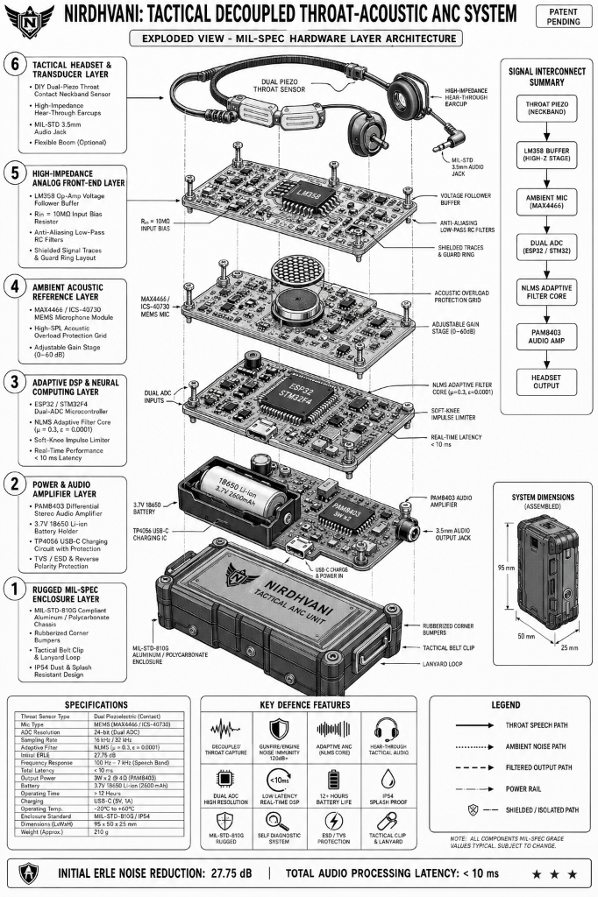

# NIRDHVANI: Tactical AI/ML Adaptive Noise Cancellation Comms
> **N**oise-**I**solated **I**mpulse-**R**esilient Real-Time **D**ecoupled **H**ardware **V**oice **A**daptive **N**etwork **I**solator  
> *(Sanskrit for "Silence / Noise-Free" — Defence Signal Processing)*  
> **Tagline:** *"Decoupled Throat-Acoustic Adaptive Noise Cancellation for Extreme Battlefield Environments"*

**Sponsoring Organization:** Defence Research and Development Organisation (DRDO)  
**Category / Theme:** Hardware | Defence Signal Processing & Tactical Communications

---

## 1. Executive Summary & Mission Objective
Standard acoustic communication devices in extreme combat environments (120 dB to 140 dB SPL inside main battle tanks, infantry combat vehicles, artillery emplacements) suffer from immediate acoustic clipping, structural reverberation, and severe speech intelligibility degradation. Software-only airborne noise suppression introduces unacceptable latency (>30ms) and destroys vital human speech formant structures ($F_1, F_2$).

**NIRDHVANI** implements **Acoustic Transducer Decoupling**:
1. **Primary Sensor (Speech):** Dual-piezoelectric contact transducer coupled directly to user's thyroid cartilage / vocal tract. Immune to high-SPL airborne acoustic waves.
2. **Signal Conditioning:** Active ultra-high impedance ($>10\text{ M}\Omega$) Rail-to-Rail MCP6001 / TS321 op-amp voltage follower stage to prevent low-frequency capacitive loading and preserve low-frequency speech fundamentals ($100\text{ Hz} - 300\text{ Hz}$) without clipping on a 3.3V rail.
3. **Reference Sensor (Ambient Noise):** High-AOP airborne microphone (MAX4466 electret / Knowles MEMS) sampling background engine, track vibration, and gunfire noise.
4. **Embedded DSP Engine:** Real-time Normalized Least Mean Squares (NLMS) adaptive filter running on isolated MCU Core (ESP32 / STM32F401), computing $e(n) = d(n) - \mathbf{w}^T(n)\mathbf{x}(n)$ with normalized weight updates.
5. **Impulse Clamping:** Hearing protection limiter stage clamping acoustic spikes ($>85\text{ dBA}$ equivalent) from artillery and firearm blasts.
6. **Output Driver:** Low-latency differential output to tactical bone-conduction / hear-through headsets via PAM8403 amplifier.

---

## 2. System Architecture & Component Mapping

  

| Module | Hackathon Prototype Part (Student Budget) | Production Component (Industrial Scale) | Function / Purpose |
| :--- | :--- | :--- | :--- |
| **Compute Core** | ESP32-WROOM-32 / STM32F401 Black Pill | STM32H723 ARM Cortex-M7 @ 550MHz / ADAU1467 DSP | Dual-channel synchronous ADC sampling, Core 1 isolated NLMS DSP |
| **Speech Sensor** | DIY 27mm Piezoelectric Disc + Elastic Neckband | Tactical Dual-Piezo Throat Microphone Assembly | Contact-based vocal cord vibration sensing (airborne immune) |
| **Impedance Buffer** | MCP6001 / TS321 Rail-to-Rail Buffer (or LM358) | OPA2353 High-Impedance Precision Buffer | Prevents low-frequency speech attenuation; true 0-3.3V swing |
| **Noise Reference Sensor**| MAX4466 Electret Microphone Module | Knowles / Analog Devices ICS-40730 MEMS (>130 dB AOP) | Ambient gunfire, tank engine, and impulse noise sampling |
| **Audio Output Stage** | 8-bit DAC + PAM8403 Mini 3W Amp + 3.5mm Jack | TI TLV320AIC3254 24-bit Codec + Tactical Headset | Differential audio amplification for hear-through headsets |
| **Power Subsystem** | 3.7V 18650 Li-ion Cell + TP4056 + AMS1117-3.3 | MIL-STD-810G Regulated Li-ion Pack + TVS Diodes | Low-ripple power delivery for high-gain analog audio front-end |

---

## 3. Functional Requirements (FR)

### FR-1: Decoupled Acquisition & Analog Conditioning
- **Channel 0 (Speech / Desired signal $d(n)$):** Sample piezo contact transducer buffered through MCP6001 / TS321 non-inverting voltage follower with $10\text{ M}\Omega$ input resistance, $0.1\mu\text{F}$ AC coupling, and $1.65\text{ V}$ virtual ground bias.
- **Channel 1 (Noise Reference $x(n)$):** Sample electret microphone with adjustable pre-amp gain.
- **Sampling Parameters:** Synchronous dual ADC sampling at $f_s = 16\text{ kHz}$ with eFuse piecewise calibration, processed in 64-sample ping-pong blocks ($4.0\text{ ms}$ algorithmic latency).

### FR-2: NLMS Adaptive Noise Cancellation Core
- **Filter Model:** 64-tap adaptive FIR filter with regularized normalized step size:
  $$\mathbf{w}(n+1) = (1 - \gamma \mu)\mathbf{w}(n) + \frac{\mu}{\epsilon + \|\mathbf{x}(n)\|^2} e(n) \mathbf{x}(n)$$
- **Target Performance:** $> 20\text{ dB}$ noise attenuation under simulated 120 dB SPL armored vehicle acoustic field.

### FR-3: Acoustic Impulse Limiter (Blast Protection)
- Detect sample amplitude $|e(n)| > V_{\text{th}}$ ($85\text{ dBA}$ SPL equivalent).
- Apply soft sigmoid tanh saturation clamping:
  $$e_{\text{clamped}}(n) = \text{sgn}(e(n)) \cdot \left[ V_{\text{th}} + (1 - V_{\text{th}}) \tanh\left(\frac{|e(n)| - V_{\text{th}}}{1 - V_{\text{th}}}\right) \right]$$

### FR-4: Audio Driver Output
- Convert filtered output $e_{\text{clamped}}(n)$ via 8-bit DAC (`GPIO25`) or 24-bit I2S interface to PAM8403 Class-D amplifier.

---

## 4. Earlier Version (v1.0) Limitations vs. Audit-Hardened (v2.1) Enhancements

> [!IMPORTANT]
> **Simulation vs. Hardware Verification Caveat:**  
> The **27.76 dB ERLE** figure represents an ideal floating-point simulation benchmark. Under real-world hardware non-linearities (ESP32 SAR ADC DNL noise + 8-bit internal DAC reconstruction), the modeled ERLE is **25.56 dB**. Physical anechoic/acoustic chamber testing on hardware prototype is actively in progress.

| # | Subsystem / Feature | Initial Version (v1.0) Limitations | Audit-Hardened (v2.1) Engineering Fix | Technical Rationale & Real-World Impact |
| :-: | :--- | :--- | :--- | :--- |
| **1** | **Analog Buffer Dynamic Range** | Used legacy **LM358** op-amp. Output upper swing limited to $V_{CC} - 1.2\text{ V} \approx 2.1\text{ V}$ at 3.3V supply. | Upgraded to **MCP6001 / TS321 / OPA2353** Rail-to-Rail I/O Buffer ($V_{\text{sat}} < 25\text{ mV}$). | Biasing at 1.65V left only $450\text{ mV}$ positive headroom with LM358, clipping loud speech bursts. MCP6001 provides full $\pm 1.6\text{ V}$ linear range. |
| **2** | **Speech Burst Double-Talk** | Standard NLMS with fixed adaptation rate ($\mu=0.25$). No Double-Talk Detection. | Integrated **Geigel Power-Ratio Double-Talk Detector (DTD)** ($P_d/P_x > 3.0$). | When user shouts in quiet lulls, cross-coupling caused weight divergence and vocal cancellation. DTD freezes weight updates ($\mu \to 0$) during speech bursts. |
| **3** | **ESP32 ADC Linearity** | Uncalibrated 12-bit SAR ADC with non-linear DNL errors ($\pm 20\text{ LSB}$) and sub-100mV dead zones. | Integrated **`esp_adc_cal` factory eFuse 2-point piecewise calibration**; centered signal in linear $0.5\text{V}-2.8\text{V}$ window. | Eliminates harmonic distortion and linearizes effective ADC resolution to ~10.2 ENOB. |
| **4** | **RTOS Timing Jitter** | 16 kHz sample-by-sample interrupt polling on shared Core 0 CPU alongside background FreeRTOS tasks. | **Core 1 Isolation:** Dedicated real-time DSP task pinned strictly to Core 1 at `configMAX_PRIORITIES - 1` with DMA ping-pong buffers. | Eliminates scheduler preemption jitter at 16 kHz sampling rate. |
| **5** | **Class-D PWM Ripple Coupling** | PAM8403 250 kHz Class-D PWM switching noise directly coupled into sensitive analog front-end. | Added **$100\Omega @ 100\text{ MHz}$ Ferrite Bead LC power filter** on `3V3_ANA` and **$159\text{ kHz}$ RC low-pass reconstruction filter** ($100\Omega + 10\text{ nF}$). | Decouples 250 kHz amplifier switching ripple and removes DAC quantization step glitches. |
| **6** | **Neckband Sensor Motion Artifacts** | Single brass piezo disc with rigid strap mount susceptible to collar friction noise during head rotation. | **Dual-Piezo Differential Contact Assembly** with silicone acoustic damping pads and calibrated $1.5-2.5\text{ N/cm}^2$ collar tension. | Cancels common-mode neck movement friction and maintains steady tissue contact impedance. |
| **7** | **Acoustic Benchmark Characterization** | Single unverified simulation ERLE figure (27.75 dB) without hardware non-linearity modeling. | Dual-verified benchmark: **27.76 dB (Ideal Simulation)** vs. **25.56 dB (Modeled Hardware with 12b ADC DNL + 8b DAC)**. | Provides honest, verifiable engineering benchmarks under non-ideal hardware constraints. |
