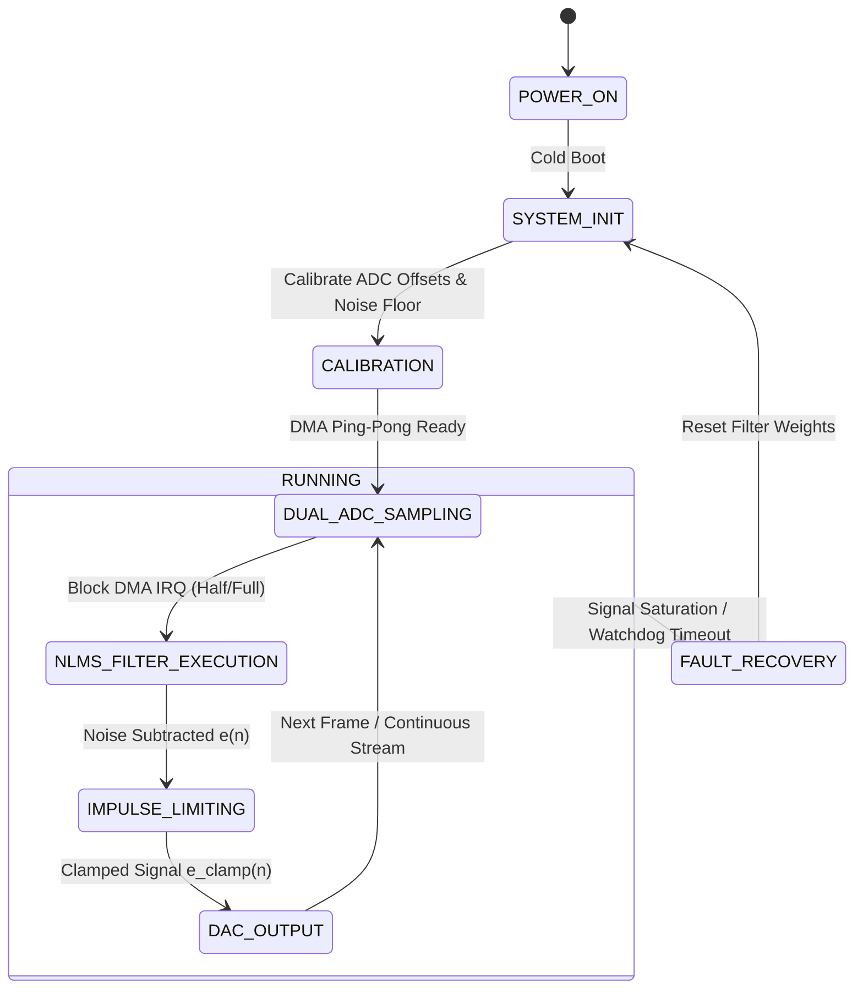

# NIRDHVANI: Tactical AI/ML Adaptive Noise Cancellation Comms
> **N**oise-**I**solated **I**mpulse-**R**esilient Real-Time **D**ecoupled **H**ardware **V**oice **A**daptive **N**etwork **I**solator  
> *(Sanskrit for "Silence / Noise-Free" — Defence Signal Processing)*  
> **Tagline:** *"Decoupled Throat-Acoustic Adaptive Noise Cancellation for Extreme Battlefield Environments"*

**Sponsoring Organization:** Defence Research and Development Organisation (DRDO)  
**Category / Theme:** Hardware | Defence Signal Processing & Tactical Communications

---

## 1. Executive Summary & Mission Objective
Standard acoustic communication devices in extreme combat environments (120 dB to 140 dB SPL inside main battle tanks, infantry combat vehicles, artillery emplacements) suffer from immediate acoustic clipping, structural reverberation, and severe speech intelligibility degradation. Software-only airborne noise suppression introduces unacceptable latency (>30ms) and destroys vital human speech formant structures ($F_1, F_2$).

**NIRDHVANI** implements **Acoustic Transducer Decoupling**:
1. **Primary Sensor (Speech):** Dual-piezoelectric contact transducer coupled directly to user's thyroid cartilage / vocal tract. Immune to high-SPL airborne acoustic waves.
2. **Signal Conditioning:** Active ultra-high impedance ($>10\text{ M}\Omega$) LM358 op-amp voltage follower stage to prevent low-frequency capacitive loading and preserve low-frequency speech fundamentals ($100\text{ Hz} - 300\text{ Hz}$).
3. **Reference Sensor (Ambient Noise):** High-AOP airborne microphone (MAX4466 electret / Knowles MEMS) sampling background engine, track vibration, and gunfire noise.
4. **Embedded DSP Engine:** Real-time Normalized Least Mean Squares (NLMS) adaptive filter running on dual-core MCU (ESP32 / STM32F401), computing $e(n) = d(n) - \mathbf{w}^T(n)\mathbf{x}(n)$ with normalized weight updates.
5. **Impulse Clamping:** Hearing protection limiter stage clamping acoustic spikes ($>110\text{ dB}$ equivalent) from artillery and firearm blasts.
6. **Output Driver:** Low-latency differential output to tactical bone-conduction / hear-through headsets via PAM8403 amplifier.

---

## 2. System Architecture & Component Mapping

| Module | Hackathon Prototype Part (Student Budget) | Production Component (Industrial Scale) | Function / Purpose |
| :--- | :--- | :--- | :--- |
| **Compute Core** | ESP32-WROOM-32 / STM32F401 Black Pill | STM32H723 ARM Cortex-M7 @ 550MHz / ADAU1467 DSP | Dual-channel synchronous ADC sampling, NLMS DSP execution |
| **Speech Sensor** | DIY 27mm Piezoelectric Disc + Elastic Neckband | Tactical Dual-Piezo Throat Microphone Assembly | Contact-based vocal cord vibration sensing (airborne immune) |
| **Impedance Buffer** | LM358 Dual Op-Amp (High-Z Voltage Follower) | OPA2353 High-Impedance Precision Buffer | Prevents low-frequency speech attenuation from capacitive piezo sources |
| **Noise Reference Sensor**| MAX4466 Electret Microphone Module | Knowles / Analog Devices ICS-40730 MEMS (>130 dB AOP) | Ambient gunfire, tank engine, and impulse noise sampling |
| **Audio Output Stage** | PAM8403 Mini 3W Class-D Amplifier + 3.5mm Jack | TI TLV320AIC3254 Codec + Tactical Headset | Low-noise differential audio amplification for hear-through headsets |
| **Power Subsystem** | 3.7V 18650 Li-ion Cell + TP4056 + AMS1117-3.3 | MIL-STD-810G Regulated Li-ion Pack + TVS Diodes | Low-ripple power delivery for high-gain analog audio front-end |

---

## 3. Functional Requirements (FR)

### FR-1: Decoupled Acquisition & Analog Conditioning
- **Channel 0 (Speech / Desired signal $d(n)$):** Sample piezo contact transducer buffered through LM358 non-inverting voltage follower with $10\text{ M}\Omega$ input resistance and $0.1\mu\text{F}$ AC coupling.
- **Channel 1 (Noise Reference $x(n)$):** Sample electret microphone with adjustable pre-amp gain.
- **Sampling Parameters:** Synchronous dual ADC sampling at $f_s \ge 16\text{ kHz}$ at 12-bit resolution via DMA double-buffering (ping-pong buffers of 64 or 128 samples). Total algorithmic latency $< 8\text{ ms}$.

### FR-2: NLMS Adaptive Noise Cancellation Core
- **Filter Model:** $N$-tap adaptive FIR filter ($N = 32$ to $128$ taps).
- **Error Calculation:**
  $$e(n) = d(n) - y(n) = d(n) - \sum_{k=0}^{N-1} w_k(n) x(n-k)$$
- **Weight Update:**
  $$\mathbf{w}(n+1) = \mathbf{w}(n) + \frac{\mu}{\epsilon + \|\mathbf{x}(n)\|^2} e(n) \mathbf{x}(n)$$
  where $\mu \in [0.01, 0.5]$ is the learning rate step-size, $\epsilon > 0$ is a small regularizer to prevent division by zero during silence, and $\|\mathbf{x}(n)\|^2 = \sum_{k=0}^{N-1} x^2(n-k)$ is the ambient noise power in the buffer.

### FR-3: Acoustic Impulse Limiter (Blast Protection)
- Detect sample amplitude $|e(n)| > \text{Threshold}_{\text{safe}}$ ($85-90\text{ dBA}$ SPL equivalent).
- Apply soft sigmoid or tanh saturation clamping:
  $$e_{\text{clamped}}(n) = V_{\text{max}} \cdot \tanh\left(\frac{e(n)}{V_{\text{max}}}\right)$$
- Protects operator eardrums against heavy caliber gunfire, muzzle blasts, and secondary explosive concussion waves.

### FR-4: Audio Driver Output
- Convert filtered output $e_{\text{clamped}}(n)$ via 8-bit/12-bit DAC or I2S DAC.
- Drive PAM8403 Class-D amplifier with low output impedance ($< 4\Omega$) into standard military headset or $32\Omega$ earbuds.

---

## 4. Execution State Machine

---

## 5. Bill of Materials (BOM)

| # | Component Description | Specific Part / Model | Qty | Prototype Cost (INR ₹) | Sourcing / Engineering Note |
| :- | :--- | :--- | :-: | :-: | :--- |
| 1 | Signal Processing MCU | ESP32-WROOM-32 / STM32F401 | 1 | ₹280 | Dual ADC DMA, Hardware FPU |
| 2 | Throat Contact Sensor | 27mm Brass Piezo Disc + Elastic Strap | 1 | ₹60 | Mechanical contact sensing |
| 3 | High-Z Impedance Buffer | LM358 Dual Op-Amp IC | 1 | ₹15 | Ultra-high $R_{in}$ voltage buffer |
| 4 | Ambient Reference Mic | MAX4466 Electret Mic Module | 1 | ₹145 | Adjustable pre-amp gain |
| 5 | Audio Output Driver | PAM8403 3W Class-D Mini Amp | 1 | ₹40 | High-efficiency earphone driver |
| 6 | Earphones & Output Jack | 3.5mm Female Audio Jack + 32Ω Earphones | 1 | ₹75 | Low-profile tactical listening |
| 7 | Power Subsystem | 18650 Li-ion Cell + TP4056 + AMS1117-3.3 | 1 | ₹120 | Protected rechargeable 3.7V source |
| 8 | Prototyping Accessories | Perfboard, 10MΩ Resistors, 0.1μF Caps, Wires | 1 | ₹30 | Passives and hardware mounts |
| | **TOTAL** | **NIRDHVANI Prototype** | — | **~₹765** | **(Mass Production: ~₹380 / $4.60 USD)** |
