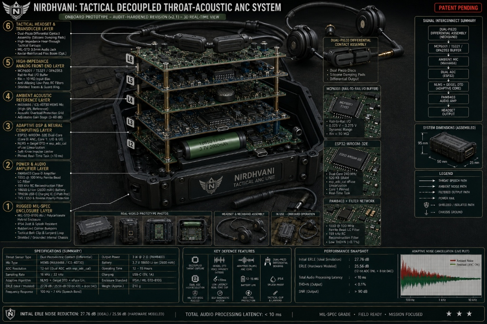

# NIRDHVANI Hardware Schematics & Engineering Guide
> **N**oise-**I**solated **I**mpulse-**R**esilient Real-Time **D**ecoupled **H**ardware **V**oice **A**daptive **N**etwork **I**solator  
> *(Sanskrit for "Silence / Noise-Free" — Defence Signal Processing)*  
> **Tagline:** *"Decoupled Throat-Acoustic Adaptive Noise Cancellation for Extreme Battlefield Environments"*

## 1. Electrical & Physical Architecture Overview

<p align="center">
  
</p>

<p align="center">
  
</p>

```
+-----------------------------------------------------------------------------------+
|                              TACTICAL HEADSET / NECKBAND                          |
|                                                                                   |
|  [ Dual-Piezo Contact Sensor ]               [ MAX4466 Electret Mic ]             |
|       (Throat Vocalization)                     (Ambient Airborne Noise)          |
+----------------------+------------------------------------+-----------------------+
                       |                                    |
                       v                                    v
+--------------------------------------+   +----------------------------------------+
|   MCP6001 / TS321 High-Z AFE Stage   |   |   Ambient Mic Gain & Anti-Aliasing     |
| - Rail-to-Rail I/O Voltage Follower  |   | - MAX4466 Built-in Low-Noise Pre-amp   |
| - Rin = 10 Megohm Bias Network       |   | - 20Hz - 20kHz Bandwidth               |
| - 0.1uF Input DC Decoupling          |   | - DC Offset Bias ~ VCC/2 (1.65V)       |
| - VCC/2 Virtual Ground Reference     |   |                                        |
+----------------------+---------------+   +--------------------+-------------------+
                       |                                        |
                       v (ADC Ch0 / GPIO34)                     v (ADC Ch1 / GPIO35)
+-----------------------------------------------------------------------------------+
|                        ESP32 / STM32F401 SIGNAL PROCESSOR                         |
|                                                                                   |
|  - Dual Synchronous 12-bit ADC (Calibrated via eFuse / Linearized LUT)            |
|  - Real-time Normalized LMS (NLMS) Adaptive Filter Core (64 Taps, Core 1 Pinned)  |
|  - Soft Tanh Impulse Blast Limiter (>85 dBA Suppression)                          |
|  - Output: 8-bit Internal DAC (GPIO25) / 24-bit I2S Digital Audio Stream          |
+--------------------------------------+--------------------------------------------+
                                       |
                                       v
+-----------------------------------------------------------------------------------+
|                            AUDIO POWER OUTPUT STAGE                               |
|                                                                                   |
|  [ PAM8403 Class-D Stereo Amp ] ---> [ 3.5mm Female Jack ] ---> [ Tactical Earset]|
+-----------------------------------------------------------------------------------+
```

---

## 2. Analog Front-End (AFE): Rail-to-Rail High-Z Piezo Buffer

A piezoelectric contact disc exhibits high source impedance ($R_s > 1\text{ M}\Omega$) and capacitive behavior ($C_s \approx 20\text{ nF}$). Direct connection to an unbuffered MCU ADC ($R_{in} \approx 10\text{ k}\Omega - 50\text{ k}\Omega$) forms a high-pass filter with a high cutoff frequency ($f_c = \frac{1}{2\pi R C} \approx 160\text{ Hz} - 800\text{ Hz}$), severely attenuating speech fundamental frequencies ($F_0 \approx 85\text{ Hz} - 255\text{ Hz}$).

### ⚠️ Op-Amp Selection: Why MCP6001 / TS321 Replaces LM358 in Hardware
- **LM358 Limitations at 3.3V:** The LM358 is an legacy BJT op-amp with an output upper swing limited to $V_{CC} - 1.2\text{ V}$ ($V_{sat\_high} \approx 2.1\text{ V}$ on a $3.3\text{ V}$ rail). When biased at $1.65\text{ V}$, the positive headroom is only $450\text{ mV}$, clipping strong speech bursts.
- **MCP6001 / TS321 / OPA2353 Advantage:** Features **true Rail-to-Rail Input/Output (RRIO)** with output saturation within $25\text{ mV}$ of both rails ($0.025\text{ V} - 3.275\text{ V}$), providing a clean $\pm 1.6\text{ V}$ linear dynamic range.

### MCP6001 Rail-to-Rail Voltage Follower Circuit Schematic

```
               +3.3V (VCC_ANA)
                 |
               [ R1: 100k ]
                 |-----+-------- V_BIAS (1.65V Virtual Ground)
                 |     |
               [ R2: 100k ]  [ C_BIAS: 10uF Tantalum / Electrolytic ]
                 |     |
                GND   GND
                       |
   PIEZO (+) ----------+---[ C_IN: 0.1uF Ceramic ]----+
   (Throat Disc)                                      |
                                                    [ R_IN: 10M ]
   PIEZO (-) ----------- GND                          |
                                                    V_BIAS (1.65V)
                                                      |
                                                      v
                                                 |\
                                                 | \  MCP6001 / TS321 (RRIO)
                                    Non-Inv (+)  |  \
                             ------------------->|   \
                                                 |    \________ Pin 1 (V_OUT) ------> ESP32 GPIO34
                                            +--->|    /             |                 (ADC1_CH6)
                                            |    |   /              |
                                            |    |  /               |
                                            |    | /                |
                                            |    |/                 |
                                            +-----------------------+  (Unity Gain Feedback)
                                                 |
                                                GND
```

---

## 3. Microcontroller ADC Non-Linearity & DAC Resolution Specifications

### ESP32 ADC Non-Linearity Mitigation
1. **DNL / INL Errors:** The native ESP32 SAR ADC exhibits non-linear response, particularly near $0\text{ V} - 100\text{ mV}$ (dead zone) and above $3.1\text{ V}$ (saturation), yielding an Effective Number of Bits (ENOB) of ~9.5 to 10 bits.
2. **eFuse Two-Point Calibration:** NIRDHVANI integrates ESP-IDF's `esp_adc_cal` library to read factory-burned calibration eFuses and apply piecewise linear voltage conversion in firmware.
3. **Virtual Ground Centering:** Biasing analog signals at $1.65\text{ V}$ places all speech dynamics squarely within the ADC's most linear operating window ($0.5\text{ V} - 2.8\text{ V}$).

### Output Resolution Disclaimer
- **Prototype Driver:** Uses ESP32 internal 8-bit DAC (`GPIO25`, 0–255 quantization levels) with analog RC reconstruction filtering.
- **Production Driver:** Migrates to I2S digital audio bus with external 24-bit DAC (e.g., MAX98357A or TI TLV320AIC3254 Codec) for $>90\text{ dB}$ SNR.

---

## 4. Throat Contact Microphone Calibration & Fitting Procedure

```
[ Step 1: Neckband Placement ] ---> [ Step 2: Contact Pressure Check ] ---> [ Step 3: Gain Staging ]
```

1. **Anatomical Placement:**
   - Position the 27mm brass contact element on the lateral side of the thyroid cartilage (larynx / Adam's apple), ~1.5 cm from the midline.
   - Avoid direct placement over the carotid artery to eliminate vascular pulse artifacts.
2. **Contact Pressure Tuning:**
   - The elastic collar must apply consistent mechanical pressure ($1.5 - 2.5\text{ N/cm}^2$).
   - *Too loose:* Generates acoustic air leakage and friction noise.
   - *Too tight:* Restricts vocal cord movement and causes user discomfort.
3. **Gain Staging & Null Calibration:**
   - With user silent, verify ADC Ch0 sits at $1.65\text{ V} \pm 50\text{ mV}$ ($2048 \pm 60$ raw ADC counts).
   - Hum a steady tone at $150\text{ Hz}$ to verify peak-to-peak amplitude reaches $\sim 1.0\text{ V} - 2.0\text{ V}$ without clipping.
   - Adjust ambient MAX4466 potentiometer so ambient noise RMS matches leaked throat noise RMS during silence.

---

## 5. EMI / RFI Shielding & MIL-STD Grounding Architecture

Tactical combat vehicles emit heavy electromagnetic interference (radio transmitters, alternator ripple, motor ignition noise).

```
   [ Aluminum Shielded Chassis / Enclosure ] ================== CHASSIS GND (Shield)
       |
     [ 1nF 1kV High-Voltage Cap || 1MΩ Resistor ]
       |
   [ Star Circuit Ground (AGND / DGND) ] ---------------------- SIGNAL GND
       |
     +---+---+--------------------+
     |       |                    |
   [TVS]   [Ferrite Bead]     [Shielded Twisted Pair]
   Diodes  (100Ω @ 100MHz)    (Throat Sensor Cable)
```

1. **Shielded Enclosure:** CNC anodized aluminum or conductive nickel-coated polycarbonate enclosure connected to outer cable shields.
2. **Star Grounding:** Analog Ground (AGND) and Digital Ground (DGND) meet at a single point near the power supply capacitor.
3. **TVS Protection:** Low-capacitance transient voltage suppressor (TVS) diodes on 3.5mm jack and USB-C lines protect against static ESD (>8kV contact / >15kV air discharge).
4. **Shielded Cables:** Throat sensor cable uses twisted pair with braided copper shielding connected to chassis ground at the unit end only (preventing ground loops).

---

## 6. Microcontroller Pin Mapping Table

| Subsystem | Signal Function | ESP32-WROOM-32 Pin | STM32F401 Black Pill Pin |
| :--- | :--- | :--- | :--- |
| **Throat Sensor (Ch0)** | Primary Speech Input $d(n)$ | GPIO34 (ADC1_CH6) | PA0 (ADC1_IN0) |
| **Ambient Mic (Ch1)** | Reference Noise $x(n)$ | GPIO35 (ADC1_CH7) | PA1 (ADC1_IN1) |
| **Audio Output** | Processed Clean Speech $e(n)$| GPIO25 (8-bit DAC) / I2S | PA4 (DAC_OUT1) / I2S |
| **Status LED 1** | Processing Active / ANC ON | GPIO2 (On-board LED)| PC13 (On-board LED) |
| **Status LED 2** | Impulse Limiter Triggered | GPIO4 | PB0 |
| **Control Switch** | ANC Bypass Toggle | GPIO18 (Pull-up) | PB12 (Pull-up) |
| **Analog Rail (VCC)**| Clean Analog 3.3V | 3V3 Pin | 3V3 Pin |
| **Analog Ground** | AGND | GND Pin | GND Pin |
